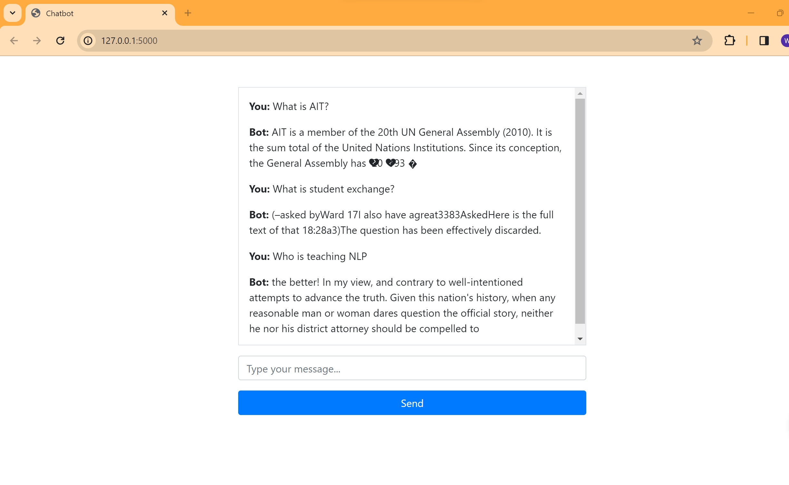

# NLP-2024-A7

# Student Information

Name : Wut Yee Aung - st124377

# Task1

I refer to webcrawling function which is developed by Kaung Htet Cho to extract the pdf file from website by providing search results from https://ait.ac.th/?s=Annual+report and https://ait.ac.th/?s=BROCHURE

Provided links
-   https://ait.ac.th/2023/07/ait-publishes-its-annual-report-and-sustainability-report-for-2022/
-   https://ait.ac.th/2020/09/new-ait-sustainability-report-2019-3/
-   https://ait.ac.th/annual-reports/
-   https://ait.ac.th/research-report/
-   https://ait.ac.th/program/professional-master-in-project-management-mpm/
-   https://ait.ac.th/program/agri-business-management/

Total pdf files are 39 annual reports, 11 research reports and 30 brochures.

I can only use GPT2 model with the limitation of resources with no GPU.

<!-- %cd ./model_gpt2
!git clone https://huggingface.co/anas-awadalla/gpt2-span-head-few-shot-k-16-finetuned-squad-seed-0 -->

# Task2
In the prompt attemp, the result seems a little bit fine but from the web application, the result is totally difference. The model seems really bad. It is because of dataset and resource limitation.

# Task3
Users can type anything related to AIT and AIT_Chatbot will reply by retrieve relevant documents from a database. The chain dictionary stores questions, answers, and chat_history and returns both the generated response and the corresponding source documents.

Web app is running on localhost:5000

